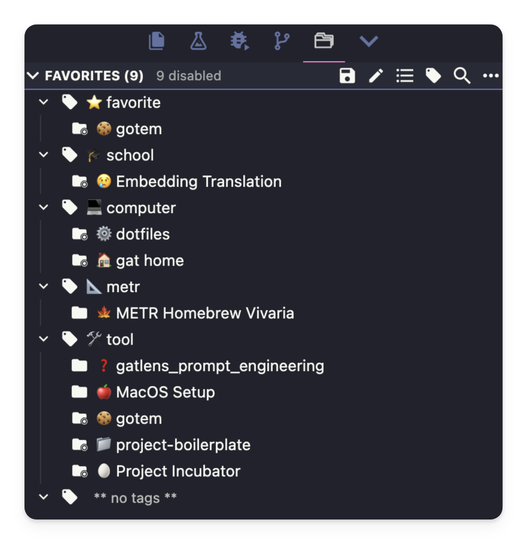
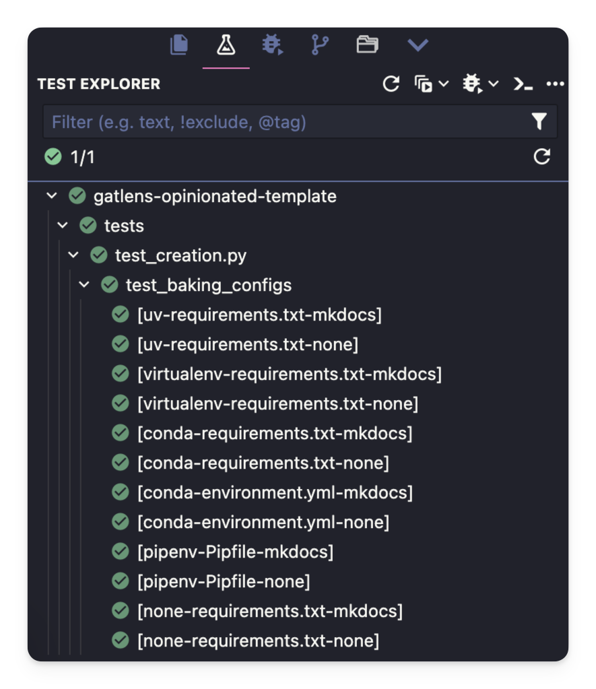
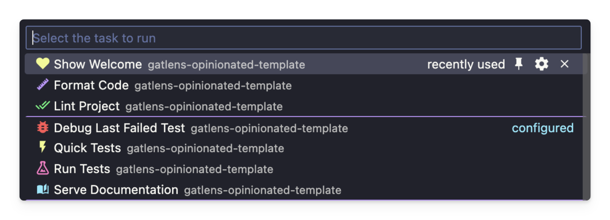

# VSCode & Cursor Workspace Configuration

VSCode and Cursor are very popular IDEs and GOTem treats them as equally important as the rest of the project configuration if you choose to take advantage of them. All files and settings mentioned here are located in `{{ cookiecutter.repo_name }}/.vscode`.


## 01 code-workspace

There are two [code-workspace files](https://code.visualstudio.com/docs/editor/workspaces) available, one for a team configuration 
<!-- (later this may become an "unnamed" workspace setup) -->
and one for your personal workspace-level configuration. The team one is meant to be synced while each individual may have a personal one if they decide to use different settings. This way your team can share debug configurations, task setups, special settings, extension recommendations, and more.

The workspace file, as opposed to a single-folder workspace, has the added benefit of [supporting multiple roots](https://code.visualstudio.com/docs/editor/workspaces#_what-is-the-benefit-of-multiroot-workspace-over-a-folder).
<!-- TODO: Explain -->

### 01.01 Workspace Project Manager

To easily switch between your projects, it's recommended you download the [Project Manager VSCode Extension](https://marketplace.cursorapi.com/items?itemName=alefragnani.project-manager). At the top of your code-workspace file will be a json object you can copy + paste into your `projects.json` file managed by the extension.

```json
/*
Add the object below to your projects.json file to add this project
'~/Library/Application Support/Cursor/User/globalStorage/alefragnani.project-manager/projects.json'
{
  "name": "🍪 {{ cookiecutter.repo_name }} (Team Workspace)",
  "rootPath": "/Path/to/your/project/{{ cookiecutter.repo_name }}/.vscode/{{ cookiecutter.repo_name }}.team.code-workspace",
  "tags": [
    "🪿 gotem"
  ],
  "enabled": true
},
```


_An example of my project manager projects_


## 02 Folders
Here you can configure any additional folders you'd like to add to your workspace including remote folders, other repositories, etc.

```json
{
  ...
  "folders": [
    {
      "name": "root",
      "path": "..",
    },
    // Option #02
    // {
    // 	"name": "package",
    // 	"path": "../{{ cookiecutter.module_name }}/"
    // }
  ],
  ...
}
```

## 03 Settings
This is where your team can share specific vscode settings for consitency. For example: Path to your SSH config file, auto-formatting on save, and more. The bulk of the current existing settings are files that are okay to be ignored in the file explorer since you never directly edit them (ex: `.git` directory, build files, or cache files)

```json
{
  ...
  "settings": {
    "remote.SSH.configFile": "${workspaceFolder}/secrets/ssh/config.ssh",
    
    // Excluded Files Won't Show in Sidebar
    "files.exclude": {
      // Option #02
      "**/{{ cookiecutter.module_name }}/": false,
      // Version Control
      "**/.git": false,
      "**/.gitattributes": false,
      "**/.github": false,
      "**/.gitignore": false,
      "**/.hg": false,
      "**/.svn": false,
      "**/CVS": false,
      // System Files
      "**/.DS_Store": false,
      "**/Thumbs.db": false,
      "**/*.bak": false,
      "**/*.sav": false,
      "**/*.backup": false,
      "**/.*.swp": false,
      "**/*~[0-9]*": false,
      // Development Environment
      "**/__pycache__": false,
      "**/*.py[cod]": false,
      "**/*$py.class": false,
      "**/.editorconfig": false,
      "**/.env": false,
      "**/.idea": false,
      "**/.ipynb_checkpoints": false,
      "**/.mypy_cache": false,
      "**/.prettierrc": false,
      "**/.pytest_cache": false,
      "**/.python-version": false,
      "**/.ruff_cache": false,
      "**/.ruby-lsp": false,
      "**/.venv": false,
      "**/.vscode": false,
      "**/*.sublime-*": false,
      "**/venv": false,
      // Build and Distribution
      "**/build": false,
      "**/dist": false,
      "**/*.egg-info": false,
      "**/wheels": false,
      "**/downloads": false,
      // Project Files
      "**/logs": false,
      "**/scripts": false,
      "**/tests": false,
      "CHANGELOG.md": false,
      "LICENSE.md": false,
      "MANIFEST": false,
      "requirements.txt": false,
      // Documentation
      "**/docs/_build": false,
      "**/site": false,
      // Testing and Coverage
      "**/.coverage": false,
      "**/.coverage.*": false,
      "**/htmlcov": false,
      "**/coverage.xml": false,
      "**/*.cover": false,
      // Databases
      "**/dump.rdb": false,
      // LaTeX
      "**/*.aux": true,
      "**/*.bbl": true,
      "**/*.bcf": true,
      "**/*.blg": true,
      "**/*.fdb_latexmk": true,
      "**/*.fls": true,
      "**/*.lof": true,
      "**/*.log": false,
      "**/*.lot": true,
      "**/*.out": true,
      "**/*.synctex.gz*": true,
      "**/*.toc": true,
      "**/_minted*": true,
    },
    "explorerExclude.backup": {},
    "workbench.colorCustomizations": {
      "editor.lineHighlightBackground": "#1073cf2d",
      "editor.lineHighlightBorder": "#9fced11f",
    },
  },
  ...
}
```

## 04 Extensions

Recommend/disrecommend extensions to your colleagues so they have a good experience. Some common, powerful, and popular extensions that fit the configuration of GOTem are included in this list below.

A good example of using this would be discouraging the default Python formatters and linters and instead encouraging use of the more modern ruff which this project is designed with in mind. This keeps things more consistent and can visually highlight the same issues used for style checks using the settings your team configured.

<!-- In the future these may be replaced -->

```json
{
  ...
  "extensions": {
    // See https://go.microsoft.com/fwlink/?LinkId=827846 to learn about workspace recommendations.
    "recommendations": [
      // Python Development
      "ms-python.python", // Python Environments, Language, and More
      "ms-python.vscode-pylance", // Python Language Server w/ Typing
      "ms-python.debugpy", // VSCode Python Debugger
      "charliermarsh.ruff", // Fast Python Linter & Formatter
      "njpwerner.autodocstring", // Automatically generate Python docstrings
      "rodolphebarbanneau.python-docstring-highlighter", // Highlight Python docstring syntax
      "kevinrose.vsc-python-indent", // Correct indents for python
      // Data Science & Notebooks
      "ms-toolsai.jupyter", // Jupyter Notebooks in VSCode
      "ms-toolsai.jupyter-renderers", // Jupyter Cell Output Renderer
      "mechatroner.rainbow-csv", // Color-coded CSV Columns
      "sbsnippets.pytorch-snippets", // Snippits for PyTorch
      // Shell & Command Line
      "mads-hartmann.bash-ide-vscode", // .*sh script language support
      "timonwong.shellcheck", // .*sh script linting
      "foxundermoon.shell-format", // .*sh script formatting
      // Remote Development
      "ms-vscode-remote.remote-containers", // Remote Connect to Docker
      "ms-vscode-remote.remote-ssh", // Remote Connect via SSH
      "ms-vscode-remote.remote-ssh-edit", // SSH Config File Editing
      // Document Formats & Preview
      "mathematic.vscode-pdf", // PDF Preview
      "vitaliymaz.vscode-svg-previewer", // SVG Preview
      "ctcuff.font-preview", // Font PReview
      "james-yu.latex-workshop", // LaTeX File Renderer for Documents
      "shd101wyy.markdown-preview-enhanced", // Improved Markdown Preview
      // Code Formatting & Style
      "esbenp.prettier-vscode", // Prettier general formatting tool
      "mrmlnc.vscode-attrs-sorter", // HTML Attribute Sorter
      "richie5um2.vscode-sort-json", // JSON Sorter
      "2gua.rainbow-brackets", // Multi-colored brackets for readability
      "aaron-bond.better-comments", // Comments w/ Styling
      // Project Management & Navigation
      "alefragnani.project-manager", // Manage VSCode Workspaces

      "peterschmalfeldt.explorer-exclude", // Keep Explorer Clean by Hiding Files
      "christian-kohler.path-intellisense", // Path Intellisense
      "kisstkondoros.vscode-gutter-preview", // Image Preview
      // Git & Version Control
      "eamodio.gitlens", // View git diffs, edits, branches and more
      // TODO: Add cookiecutter template types, include if web only
      // API Development
      "humao.rest-client", // Easily make HTTP queries for API testing
      // Build Tools
      "ms-vscode.makefile-tools", // Tools for Makefiles
      "task.vscode-task", // Tools for Taskfiles
      // Configuration Files
      "dotenv.dotenv-vscode", // .env language support
      "redhat.vscode-yaml", // .yaml language support
      "redhat.vscode-xml", // .xml language support
      // Output & Debugging
      "ibm.output-colorizer", // Automatically color-code VSCode Output logs
      "usernamehw.errorlens" // Highlight errors in-line
    ],
    // List of extensions recommended by VS Code that should not be recommended for users of this workspace.
    "unwantedRecommendations": [
      // Superceded by ruff
      "ms-python.black-formatter",
      "ms-python.isort",
      "ms-python.pylint",
      // Superceded by Pylance
      "ms-pyright.pyright"
    ]
  },
  ...
}
```

## 05 Debugger Profiles



<!-- Maybe show the python debugger -->

The VSCode debugger is one of the most popular Python debuggers out there. Sharing debug configurations between colleagues can save a lot of time especially if you're debugging different subcomponents. Ex: (1) A python CLI tool with arguments (2) Your currently selected file (3) FastAPI or some other web app (4) A separate TypeScript app (5) A docker build (6) A shell script (7) Pytest Debugging.

```json
{
  ...
  "launch": {
    "version": "0.2.0",
    "configurations": [
      {
        "name": "Debug Main",
        "type": "debugpy",
        "request": "launch",
        "program": "${workspaceFolder}/{{ cookiecutter.module_name }}/main.py",
        "console": "integratedTerminal"
      },
      {
        "name": "Debug Current File",
        "type": "debugpy",
        "request": "launch",
        "program": "${file}",
        "console": "integratedTerminal"
      }
    ]
  },
  ...
}
```

## 06 Tasks



Tasks are a lesser known/used feature of VSCode. They are essentially a way of integrating task commands like those in the `Makefile` into VSCode so you can do things like run them with a keyboard shortcut (ex: build with Cmd+Shift+B), trigger when something else happens in the IDE (on file save, on workspace open, etc.), or pass the path to your currently focused python script as an argument to a Makefile command. They can also be a nice way to visually separate your integrated VSCode terminal into different tabs.

These can be used to do stuff like (1) start watching pytests once the workspace opens, (2) rebuild documentation when a markdown file is updated (3) focus the `error.log` file automatically when your webapp crashes (4) publish your package to PyPi with Cmd+Shift+B.

All of the default Makefile tasks have been embedded in tasks.json for further customization and a few have will run on certain actions.

```json
{
  ...
  "tasks": {
    "version": "2.0.0",
    "tasks": [
      {
        "type": "shell",
        "label": "python-checks",
        "command": "poetry",
        "args": ["run", "poe", "check"],
        "group": "build",
        "detail": "Run all Python checks (format, lint, typecheck, test)",
        "runOptions": {
          "runOn": "folderOpen"
        },
        "presentation": {
          "reveal": "silent",
          "panel": "shared"
        }
      }
    ]
  }
  ...
}
```

## 07 .cursorrules (Cursor Only)

<!-- TOOD: maybe make a cursorrules compiler that summarizes aspects of the project -->

`.cursorrules` files define custom rules for Cursor AI to follow when generating code, allowing you to tailor its behavior to your specific needs and preferences.

The `.cursorrules` file defined in this project adapts to your settings, and lists best practices as well as stylistic choices.

You can find other templates for cursor rules files across the internet, a popular one being [this list](https://github.com/PatrickJS/awesome-cursorrules).

More info on the rules [here](https://medium.com/@ashinno43/what-are-cursor-rules-and-how-to-use-them-ec558468d139)

To use this file you first need to enable it:
1. 
